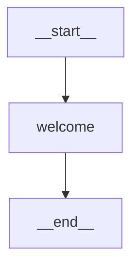
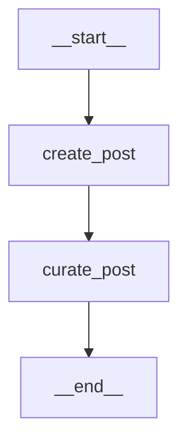
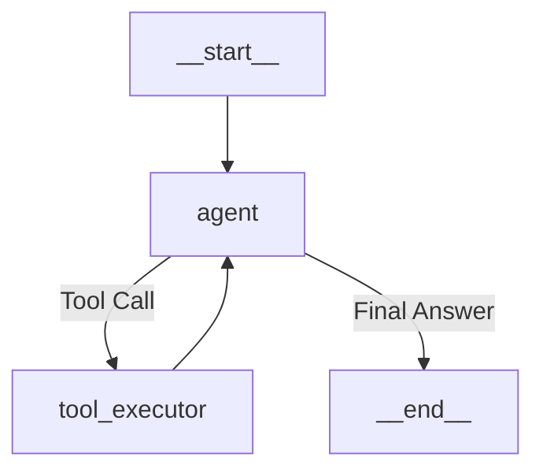
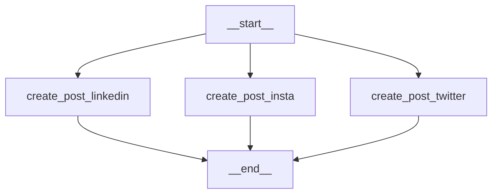
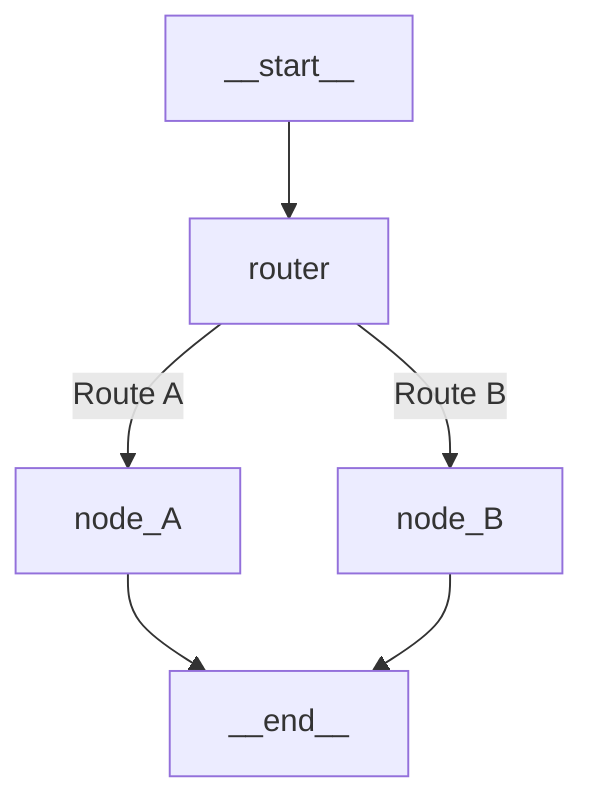
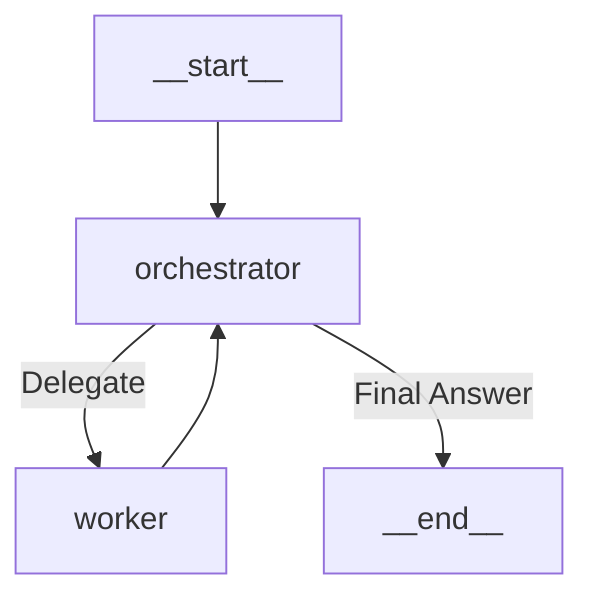
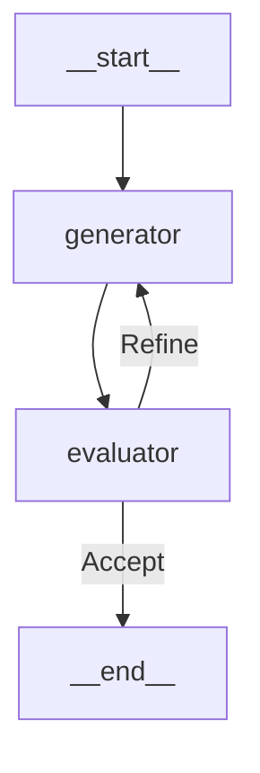
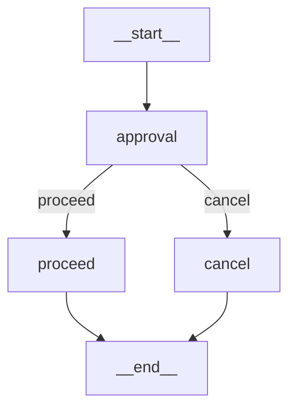

# LangGraph Tutorial: A Developer's Journal

This repository documents my journey learning `langgraph`, a powerful library for building stateful, multi-agent LLM applications. It's structured as a series of self-contained Jupyter notebooks that act as a personal knowledge transfer (KT) document, tracking my progress from the ground up.

## My Learning Objectives

My primary goal was to move beyond simple, linear LLM chains and understand how to build dynamic, cyclical, and stateful agentic systems. I focused on understanding how `langgraph` provides the framework for agents that can reason, act, reflect, and collaborate.

## Setup and Installation

1.  **Clone the Repository**:
    ```bash
    git clone <your-repo-url>
    cd langgraph-tutorial
    ```
2.  **Install Dependencies with `uv`**:
    Ensure you have `uv` installed. Then, install the required packages from `requirements.txt`. `uv` will create a virtual environment and install the dependencies into it.
    ```bash
    uv pip install -r requirements.txt
    ```
3.  **Set Up Environment Variables**:
    Create a `.env` file in the root of the project and add your Google API key. This is necessary for the LLM calls in the notebooks to function.
    ```
    GOOGLE_API_KEY="YOUR_API_KEY"
    ```
4.  **Run the Jupyter Notebooks**:
    Launch the Jupyter environment to start the tutorial.
    ```bash
    jupyter notebook
    ```

## Key Libraries and Modules

This project relies on a set of powerful libraries to build and orchestrate LLM agents. Here’s a breakdown of the key players and why they were chosen.

| Library | Purpose | Key Modules & What They Do |
| :--- | :--- | :--- |
| `langgraph` | The core library for building stateful, multi-agent applications with cyclical workflows. It extends LangChain by allowing graphs to have loops, which is essential for agentic behavior like reasoning and self-correction. | **`graph.StateGraph`**: The main class to define a new stateful graph. It takes a state schema and allows you to add nodes and edges. <br> **`graph.START`, `graph.END`**: Special identifiers for the entry and exit points of the graph, making the flow explicit. |
| `langchain_core`| Provides the foundational data structures and abstractions for the entire LangChain ecosystem. It ensures a standard way to represent messages, prompts, and runnable components. | **`messages.AIMessage`, `HumanMessage`, etc.** Classesto represent different roles in a conversation (AI, user, system). This is crucial for the LLM to understand context. <br> **`prompts.PromptTemplate`**: A tool for creating dynamic and reusable prompts that can be populated with variables at runtime. |
| `langchain_google_genai` / `langchain_openai` | These are provider-specific packages that act as a bridge to the actual LLM APIs (Google Gemini, OpenAI GPT). They handle authentication, request formatting, and response parsing. | **`chat_models.ChatGoogleGenerativeAI`**: The specific class used to instantiate and interact with Google's Gemini chat models. |
| `pydantic` | Used for data validation and settings management using Python type annotations. It ensures the state object flowing through the graph is always well-structured and valid, preventing runtime data errors. | **`BaseModel`**: The base class you inherit from to create your own custom, validated data models. <br> **`Field`**: Used within a `BaseModel` to provide extra configuration, such as descriptions or validation for a specific field. |
| `python-dotenv` | A simple library for managing environment variables. It's used as a best practice to keep sensitive data like API keys out of your source code by loading them from a `.env` file. | **`load_dotenv`**: A function that you call at the start of your application to load the variables from the `.env` file into the process's environment. |
| `typing` | The built-in Python library for type hints. It's used to make the code more readable, self-documenting, and allows static analysis tools to catch potential errors before runtime. | **`TypedDict`**: A way to define a dictionary schema with specific keys and value types. <br> **`List`**: The standard way to denote a list of a certain type. <br> **`Annotated`**: Allows attaching metadata to types, used here with a reducer function (`add`) for automatic message list management in the graph's state. |


## Notebooks: A Journal of My Learnings & Graph Diagrams

Each notebook is a step in my learning path, building upon the concepts of the previous one.

### 1. `1_basics.ipynb`: My First Graph
My journey began here. I learned the absolute fundamentals: how to define a `StateGraph` with a simple `TypedDict` schema. I created my first `nodes` (simple Python functions) and connected them with `edges` to form a basic, linear workflow from a `START` to an `END` point. This notebook established the core mental model of a graph as a state machine.

**Graph Diagram:**


### 2. `2_Pydantic.ipynb`: Structured State
Here, I moved beyond simple dictionaries to using `Pydantic` models for the graph's state. This was a significant step up in robustness. I discovered that using Pydantic allows for strong type-checking, validation, and clear documentation of the data that flows between nodes, which is crucial for more complex graphs.

**Graph Diagram:**


### 3. `3_messages.ipynb`: Managing Conversational State
This notebook introduced a more sophisticated way to handle state, specifically for conversational history. I learned two techniques: manually updating a list of messages in the state, and using the powerful `Annotated` type with a reducer function (`add`) to let `langgraph` automatically manage the message list. This simplifies the node logic significantly.

### 4. `4_Prompts&Chains.ipynb`: Building with LangChain Primitives
This notebook was a step back from `langgraph` to focus on the `langchain-core` primitives. I learned how to use `ChatPromptTemplate` to create reusable prompts and how to pipe (`|`) them into an LLM to form a basic chain. This is a foundational concept, as these chains are the building blocks for the nodes in more complex graphs.

### 5. `5_Tools&Binding.ipynb`: Giving the Agent Capabilities
Here, I learned how to give my agent tools. I explored how to define custom tools using the `@tool` decorator and how to use pre-built tools from the LangChain community. The key takeaway was the `.bind_tools()` method, which makes the LLM "aware" of the tools it can use, setting the stage for building a ReAct agent.

### 6. `6_ReAct.ipynb`: Building a Full ReAct Loop
Building on the previous notebook, I constructed a complete ReAct agent. The key was creating a conditional edge that acted as a router. After the agent node, the graph would check if the LLM decided to call a tool or provide a final answer. This routing logic is what enables the agent to loop—decide, act, observe, and repeat—until the task is complete.

**Graph Diagram:**


### 7. `7_Parallelization.ipynb`: Efficient Concurrent Execution
This notebook demonstrated how to run nodes in parallel. I created a graph with three nodes that were all connected from the `START` node. This allowed them to execute concurrently, which is a highly efficient way to handle independent tasks. The graph then collected the results from all three nodes before finishing.

**Graph Diagram:**


### 8. `8_Router.ipynb`: Advanced Conditional Logic
I went deeper into conditional routing. I built a graph where the next step was determined by a dedicated "router" node that classified the input and directed the flow to the appropriate downstream node. This is a powerful pattern for building multi-skilled agents that can handle different types of tasks.

**Graph Diagram:**


### 9. `9_Orchestrator_Worker.ipynb`: Multi-Agent Collaboration (Orchestrator Pattern)
This notebook introduced my first multi-agent system. I created an "Orchestrator" agent that would break down a task and delegate sub-tasks to specialized "Worker" agents. The graph managed the state and flow of information between the orchestrator and the workers, demonstrating a hierarchical agent structure.

**Graph Diagram:**


### 10. `10_Generator_Evaluator.ipynb`: Self-Critique and Refinement
Here I explored a powerful pattern for improving output quality. I created a "Generator" agent that would produce a result, and an "Evaluator" agent that would critique it. The graph would loop between them, allowing the generator to refine its output based on the evaluator's feedback until a quality threshold was met.

**Graph Diagram:**


### 11. `11_Memory.ipynb`: Adding Persistent Memory
This notebook was a game-changer. I learned how to add persistent memory to the graph using a **checkpointer** (`InMemorySaver`). By compiling the graph with a checkpointer and invoking it with a `thread_id`, the graph can remember the entire history of a conversation, allowing for true, stateful interactions.

### 12. `12_HumanInLoop.ipynb`: Interactive Workflows
Finally, I learned how to create a graph that can pause and wait for human input. Using the `interrupt()` command, I built a workflow that stops at an approval node, waits for an external decision, and then conditionally routes to the next step based on that decision. This is essential for building applications that require human oversight.

**Graph Diagram:**

## Key Concepts Learned

Throughout this tutorial, I mastered several core concepts that are the building blocks of `langgraph`:

*   **State Management**: I learned to define the graph's state using both simple `TypedDict` and robust `Pydantic` models, understanding the trade-offs between flexibility and type safety.

*   **Message Handling**: I explored how to manage conversational history, particularly using `Annotated` with a reducer function (`add_messages` or `operator.add`) to let `langgraph` automatically append messages to the state.

*   **Graph Construction**: I became proficient in creating a `StateGraph`, adding `nodes` (functions that modify the state), and connecting them with `edges` to define the flow of execution, always starting at `START` and finishing at `END`.

*   **Control Flow**: I learned to create dynamic graphs using:
    *   **Conditional Edges**: Routing the graph's path based on the output of a node.
    *   **Routers**: Dedicated nodes that classify input to direct the flow.
    *   **Parallel Execution**: Running multiple nodes concurrently for efficiency.

*   **Agent Patterns**: I implemented several powerful agentic patterns:
    *   **ReAct**: A loop of reasoning, acting (tool use), and observing.
    *   **Orchestrator/Worker**: A hierarchical structure for delegating tasks.
    *   **Generator/Evaluator**: A self-correcting loop for refining output.

*   **Interactivity and Memory**:
    *   **Checkpointers**: I used `InMemorySaver` to give the graph persistent memory, allowing for continuous, stateful conversations using a `thread_id`.
    *   **Human-in-the-Loop**: I learned to use `interrupt()` to pause the graph and wait for external input, enabling interactive workflows.

## Conclusion

This project was an invaluable learning experience. I've moved from thinking in linear chains to designing complex, stateful graphs. I now have a solid understanding of how to build sophisticated, multi-agent applications that can reason, use tools, collaborate, and learn. The notebooks in this repository are a testament to that journey and serve as a practical guide for anyone looking to master `langgraph`.
